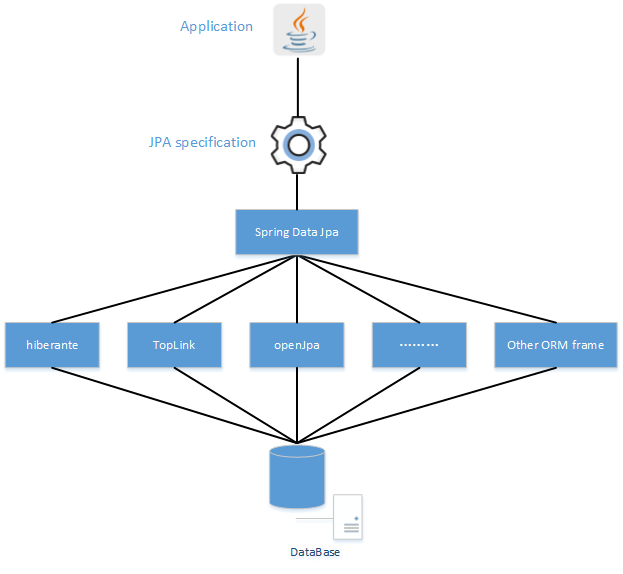

# JPA 概述及常用注解详解、SpringDataJpa 使用指南

JPA（Java Persistence API）是 Java 标准中的一套ORM规范（提供了一些编程的 API 接口，具体实现由 ORM 厂商实现，如Hiernate、TopLink 、Eclipselink等都是 JPA 的具体实现），借助 JPA 技术可以通过注解或者XML描述【对象-关系表】之间的映射关系，并将实体对象持久化到数据库中（即Object Model与Data Model间的映射）。

JPA是Java持久层API，由Sun公司开发，希望规范、简化Java对象的持久化工作，整合ORM技术，整合第三方ORM框架，建立一种标准的方式，目前也是在按照这个方向发展，但是还没能完全实现。在ORM框架中，Hibernate框架做了较好的 JPA 实现，已获得Sun的兼容认证。

## JPA 的优势：

- 1.开发者面向 JPA 规范的接口，但底层的JPA实现可以任意切换：觉得Hibernate好的，可以选择Hibernate JPA实现；觉得TopLink好的，可以选择TopLink JPA实现。

- 2.开发者可以避免为使用Hibernate学习一套ORM框架，为使用TopLink又要再学习一套ORM框架。

## JPA为我们提供了以下规范：

ORM映射元数据：JPA支持XML和注解两种元数据的形式，元数据描述对象和表之间的映射关系，框架据此将实体对象持久化到数据库表中
JPA的Criteria API：提供API来操作实体对象，执行CRUD操作，框架会自动将之转换为对应的SQL，使开发者从繁琐的 JDBC、SQL中解放出来。
JPQL查询语言：通过面向对象而非面向数据库的查询语言查询数据，避免程序的SQL语句紧密耦合。

### Hibernate介绍

Hibernate对数据库结构提供了较为完整的封装，Hibernate的O/R Mapping实现了POJO 和数据库表之间的映射，以及SQL 的自动生成和执行。往往只需定义好了POJO 到数据库表的映射关系，即可通过Hibernate 提供的方法完成持久层操作。甚至不需要对SQL 的熟练掌握， Hibernate/OJB 会根据制定的存储逻辑，自动生成对应的SQL 并调用JDBC 接口加以执行。

Hibernate框架（3.2及以上版本）对JPA接口规范做了较好的实现，主要是通过以下三个组件来实现的：

hibernate-annotation：是Hibernate支持annotation方式配置的基础，它包括了标准的 JPA annotation以及Hibernate自身特殊功能的annotation。
hibernate-core：是Hibernate的核心实现，提供了Hibernate所有的核心功能。
hibernate-entitymanager：实现了标准的 JPA，可以把它看成hibernate-core和 JPA 之间的适配器，它并不直接提供ORM的功能，而是对hibernate-core进行封装，使得Hibernate符合 JPA 的规范。
hibernate对 JPA 的支持，不是另提供了一套专用于 JPA 的注解。一些重要的注解如@Column, @OneToMany等，hibernate并没有提供，这说明 JPA 的注解已经是hibernate 的核心，hibernate只提供了一些补充，而不是两套注解。JPA 和hibernate都提供了的注解（例如@Entity），若 JPA 的注解够用，就直接用，若 JPA 的注解不够用，直接使用hibernate的即可。

### Spring Data JPA介绍

Spring Data JPA是在实现了 JPA 规范的基础上封装的一套 JPA 应用框架（Criteria API还是有些复杂）。虽然ORM框架都实现了 JPA 规范，但是在不同的ORM框架之间切换仍然需要编写不同的代码，而使用Spring Data JPA能够方便的在不同的ORM框架之间进行切换而不需要更改代码。Spring Data JPA旨在通过统一ORM框架的访问持久层的操作，来提高开发人的效率。

Spring Data JPA是一个 JPA 数据访问抽象。也就是说Spring Data JPA不是一个实现或 JPA 提供的程序，它只是一个抽象层，主要用于减少为各种持久层存储实现数据访问层所需的样板代码量。但是它还是需要JPA提供实现程序，其实Spring Data JPA底层就是使用的 Hibernate实现。

Spring Data JPA 其实并不依赖于 Spring 框架。

Spring Data JPA 通过Repository来支持上述功能，默认提供的几种Repository已经满足了绝大多数需求：

JpaRepository（ 为Repository的子接口：JpaRepository -> PagingAndSortingRepository -> CrudRepository -> Repository）
QueryByExampleExecutor
JpaSpecificationExecutor
QuerydslPredicateExecutor
后三者用于更复杂的查询，如动态查询、关联查询等；第一种用得最多，提供基于方法名（query method）的查询，用户可基于第一种继承创建自己的子接口（只要是Repository的子接口即可），并声明各种基于方法名的查询方法。

Repository 的实现类：

SimpleJpaRepository
QueryDslJpaRepository
JPA与springDataJpa、Hibernate 之间的关系


## JPA 注解
### Entity 常用注解
指定对象与数据库字段映射时注解的位置：如@Id、@Column等注解指定Entity的字段与数据库字段对应关系时，注解的位置可以在Field（属性）或Property（属性的get方法上），两者统一用其中一种，不能两者均有。推荐用前者。

- @Entity、@Table
    - @Entity（必需）
    标注在实体类上。

    映射实体类。指出该 Java 类为实体类，将映射到指定的关系数据库表。

    应用了此注解后，将会自动将类名映射作为数据库表名、将类内的字段名映射为数据库表的列名。映射策略默认是按驼峰命名法拆分将类名或字段名拆分成多部分，然后以下划线连接，如StudentEntity -> student_entity、studentName -> student_name。若不按默认映射，则可通过@Table、@Column指定，见下面。

    - @Table（可选）
    标注在实体类上。

    映射数据库表名。当实体类与其映射的数据库表名不同名时需要使用 @Table 标注说明，该标注与 @Entity 标注并列使用
    - schema属性：指定数据库名
    - name属性：指定表名，不指定时默认按驼峰命名法拆分将类名，并以下划线连接

- @DynamicInsert、@DynamicUpdate
  - @DynamicInsert（可选）

    标注在实体类上。

    设置为true，表示insert对象的时候，生成动态的insert语句，如果这个字段的值是null就不会加入到insert语句中，默认false。

  - @DynamicUpdate（可选）
  标注在实体类上。

    设置为true，表示执行update对象时，在生成动态的update语句前，会先查询该表在数据库中的字段值，并对比更新使用的对象中的字段值与数据库中的字段值是否相同，若相同（即该值没有修改），则该字段就不会被加入到update语句中。

    默认false，表示无论更新使用实体类中的字段值与数据库中的字段值是否一致，都加入到update语句中，即都使用对象中所有字段的值覆盖数据库中的字段值。

    比如只想更新某个属性，但是却把整个属性都更改了，这并不是我们希望的结果，我们希望的结果是：我更改了哪写字段，只要更新我修改的字段就够了。

    注意：
   @DynamicUpdate的动态更新的含义是，比较更新要使用的实体类中的所有字段值与从数据库中查询出来的所有字段值，判断其是否有修改，不同则加入到update语句中更新字段值。看这个例子，数据库中id=1的记录所有字段都是非空的，但是实体类中只有name有值，也就是所有字段都变了，只是其他字段被更新为了新的空值。

   所以 jpa 更新数据库字段值，无论是否有 @DynamicUpdate注解，均需要手动先select对象，然后通过set更新对象的属性值，然后再save对象，实现更新操作

- @Id、@GeneratedValue
  - @Id（必需）
    标注在实体类成员变量或getter方法之上。

    映射生成主键。用于声明一个实体类的属性映射为数据库的一个主键列。

    若同时指定了下面的@GeneratedValue则存储时会自动生成主键值，否则在存入前用户需要手动为实体赋一个主键值。

    主键值类型可以是：

    - Primitive types：
    boolean， byte， short， char， int， long， float， double

    Equivalent wrapper classes from package java.lang：
    Byte，Short， Character， Integer， Long， Float， Double

    java.math.BigInteger， java.math.BigDecimal
    java.lang.String
    java.util.Date， java.sql.Date， java.sql.Time， java.sql.Timestamp
    Any enum type
    Reference to an entity object
    composite of several keys above
    指定联合主键，有@IdClass、@EmbeddedId两种方法。

- @GeneratedValue

    @GeneratedValue 用于标注主键的生成策略，通过 strategy 属性指定。

    默认情况下，JPA 自动选择一个最适合底层数据库的主键生成策略：SqlServer 对应 identity，MySQL 对应 auto increment

  - AUTO： JPA自动选择合适的策略，是默认选项
  - IDENTITY：采用数据库 ID自增长的方式来自增主键字段，Oracle 不支持这种方式
  - TABLE：通过表产生主键，框架借由表模拟序列产生主键，使用该策略可以使应用更易于数据库移植。
  - SEQUENCE：通过序列产生主键，通过 @SequenceGenerator 注解指定序列名，MySql 不支持这种方式
- @Column、@Basic、@Transient
  - @Column（可选）

    标注在实体类成员变量或getter方法之上。

    映射表格列。当实体的属性与其映射的数据库表的列不同名时需要使用 @Column 标注说明。

    类的字段名在数据库中对应的字段名可以通过此注解的name属性指定，不指定则默认为将属性名按驼峰命名法拆分并以下划线连接，如 createTime 对应 create_time。

    注意：即使name的值中包含大写字母，对应到db后也会转成小写，如@ Column(name="create_Time") 在数据库中字段名仍为create_time。可通过SpringBoot配置参数【spring.jpa.hibernate.naming.physical-strategy】配置对应策略，如指定name值是什么，数据库中就对应什么名字的列名。默认值为:【org.springframework.boot.orm.jpa.hibernate.SpringPhysicalNamingStrategy】

    @Column注解一共有10个属性，这10个属性均为可选属性，各属性含义分别如下：

    - name：定义了被标注字段在数据库表中所对应字段的名称。
    - unique：该字段是否为唯一标识，默认为false。也可以使用@Table标记中的@UniqueConstraint。
    - nullable：该字段是否可以为null值，默认为true。
    - length：字段的长度，当字段的类型为varchar时，该属性才有效，默认为255个字符。
    - insertable：在使用“INSERT”脚本插入数据时，是否插入该字段的值。默认为true。
    - updatable：在使用“UPDATE”脚本插入数据时，是否更新该字段的值。默认为true。
    - insertable = false 和updatable = false 一般多用于只读的属性，例如主键和外键等。这些字段的值通常是自动生成的。

    columnDefinition：建表时创建该字段的DDL语句，一般用于通过Entity生成表定义时使用。
（如果DB中表已经建好，该属性没有必要使用）

    precision和scale：表示精度，当字段类型为double时，precision表示数值的总长度，scale表示小数点所占的位数。
  table：定义了包含当前字段的表名。
- @Basic（可选）

    表示一个简单的属性到数据表的字段的映射，对于没有任何标注的属性或getter方法，默认标注为 @Basic

    fetch 表示属性的读取策略，有 EAGER 和 LAZY 两种，分别为立即加载和延迟加载
    optional 表示该属性是否允许为 null，默认为 true
- @Transient：忽略属性

  定义暂态属性。表示该属性并非一个到数据库表的字段的映射，ORM 框架将忽略该属性。

  如果一个属性并非数据库表的字段映射，就必须将其标识为 @Transient，否则ORM 框架默认为其注解 @Basic，例如工具方法不需要映射。

- @Temporal：时间日期精度
  标注在实体类成员变量或getter方法之上。可选。

  在 JavaAPI 中没有定义 Date 类型的精度，而在数据库中表示 Date 类型的数据类型有 Date(年月日)，Time(时分秒)，TimeStamp(年月日时分秒) 三种精度，进行属性映射的时候可以使用 @Temporal 注解调整精度。

  目前此注解只能用于修饰JavaAPI中的【java.util.Date】、【java.util.Calendar】类型的变量，TemporalType 取 DATE、TIME、TIMESTAMP 时在MySQL中分别对应的 DATE、TIME、DATETIME 类型。

## 使用步骤

- 1.配置数据源

  这里用的yml方式,里面的jpa就是数据库的名称,大家也可以写其他的,前提是这个数据库存在,用户名和密码写自己的就好

  ```
    spring:
        datasource:
            driver-class-name: com.mysql.cj.jdbc.Driver
            url: jdbc:mysql://localhost:3306/jpa
            username: root
            password: wc
  ```

- 2.导入依赖
    
    ```
    <dependency>
      <groupId>org.springframework.boot</groupId>
      <artifactId>spring-boot-starter-data-jpa</artifactId>
    </dependency>
    ```

- 3.创建实体类并通过注解方式让数据库知道我们的表长什么样

  这里就可以知道表的名称是users(当然你可以任意取名),表的创建一般都有主键和自增操作,这里全部通过注解来完成。这里第一次创建表的时候表名会爆红,我们需要给他手动指定数据库,也就是数据源配置时的数据库
    
    ```
    @Data
    @Entity   //表示这个类是一个实体类
    @Table(name = "users")    //对应的数据库中表名称
    public class Account {
    
        @GeneratedValue(strategy = GenerationType.IDENTITY)   //生成策略，这里配置为自增
        @Column(name = "id")    //对应表中id这一列
        @Id     //此属性为主键
        int id;
    
        @Column(name = "username")   //对应表中username这一列
        String username;
    
        @Column(name = "password")   //对应表中password这一列
        String password;
    }

    ```
    这里我们还需要设置自动表定义ddl-auto
    
    ```
    spring:
          jpa:
                #开启SQL语句执行日志信息
            show-sql: true
            hibernate:
                #配置为自动创建
              ddl-auto: create

    ```
    ddl-auto属性用于设置自动表定义，可以实现自动在数据库中为我们创建一个表，表的结构会根据我们定义的实体类决定，它有4种

    - create 启动时删数据库中的表，然后创建，退出时不删除数据表
    - create-drop 启动时删数据库中的表，然后创建，退出时删除数据表 如果表不存在报错
    - update 如果启动时表格式不一致则更新表，原有数据保留
    - validate 项目启动表结构进行校验 如果不一致则报错

- 4.启动测试类完成表创建(随便一个空的测试类就行)

  这时候可以看到控制台打印这两句话,就会发现表已经创建成功了(和我们自己去敲命令行十分类似,hibernate帮我们完成这些操作,是不是很方便)
  删表是因为选择了create策略创建表,后面还会讲其他的策略。
  Hibernate: drop table if exits account
  Hibernate: create table users (id integer not null auto_increment, password varchar(255), username varchar(255), primary key (id)) engine=InnoDB

- 5.如何访问我们的表,也就是如何对表进行操作(这里用接口自带的方法,后面会讲自定义方法)
  这里我们需要自定义借口继承接口JpaRepository

    ```
    @Repository
    public interface AccountRepository extends JpaRepository<Account, Integer> {
    }
    ```

  注意JpaRepository有两个泛型，前者是具体操作的对象实体，也就是对应的表，后者是ID的类型，接口中已经定义了比较常用的数据库操作。编写接口继承即可，我们可以直接注入此接口获得实现类：
  这是查操作

    ```
    @SpringBootTest
    class JpaTestApplicationTests {
        @Resource
        AccountRepository repository;
        @Test
        void contextLoads() {
            //直接根据ID查找
            repository.findById(1).ifPresent(System.out::println);
        }
    }
    ```
