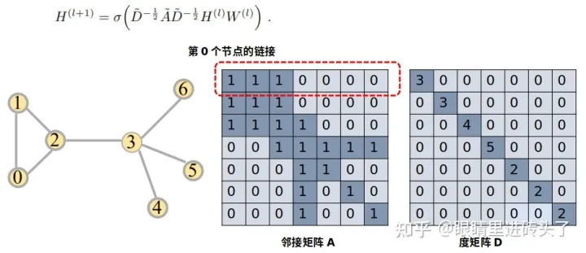

做风控的同学都知道，特别是黑灰产或者反欺诈相关的，关系网络的挖掘（团伙挖掘或者社交关系挖掘），是非常重要的一个技能，甚至说是必不可少或者最重要的技能，特别多于高阶岗位，更是刚需。今天我就整理下关系网络的学习路径，后续也会慢慢的去完善精进。

**先看看本文大纲，主要有以下10个阶段：**

1、关系介质的理解（设备指纹、手机号、IP、支付宝、银行卡、身份证等）

2、关系介质的直接应用（介质画像、黑名单库、直接关联、加权关联等）

3、高阶关系的寻找（文本关系处理、图片关系、地址关系、同步行为关系、相似关系等）

4、网络挖掘-根据关系构图（直接构图、无脑构图、同构构图、相似构图、异构构图、多介质组合构图等）

5、网络挖掘-关系的降噪与提纯（剔除关系弱的边、剔除关系强的边、剔除相似度低的边、剔除热门节点、剔除异常节点、剔除业务指标优良的节点、添加属性增强关系等）

6、网络挖掘-团伙聚类（社群检测、社群画像、社群可视化，LPA算法、Louvain算法、Leiden算法等）

7、关系网络的向量化（同构图，异构图，deepwalk，node2vec，line，metapath2vec，metapath2vec++等）

8、图神经网络（GCN，GAT、GraphSAGE、RGCN、HetGNN...等）

9、图的异常检测

10、打个广告**（****想走捷径的看看****）**

# **一、关系介质的理解**

一般来说，当面对黑产攻击，开始对案件分析，总结各种属性特征，比较年龄、性别、注册时长、低于分布、金额等，能够总结出一些有效的策略。

但是随着黑灰产的对抗加强，这些属性特征变得弱不禁风，基本上就抓不到坏人了。这个时候，就开始逐步往关系介质转移了。

两个账号有没有使用相同的手机号码、有没有同一设备登录、有没有同一WiFi连接、公司注册有没有使用相同的身份证等等，基本也就有了介质思维，也就是关系思维的雏形。

当然了，慢慢的，最好去理解关系强弱的相对性、变动性、长久或者永恒性等等。也要去理解共存关系或者位置关系等关系介质的复杂性。

# **二、关系介质的直接应用**

有了介质的思想，就开始琢磨介质怎么去应用了，最简单粗暴的思想，就是去做介质画像了，每个身份证、手机号、支付宝、IP等的违规率多少、资损金额多少、平均注册时间多少、转化率多少，对于指标异常的，可以加入介质黑名单，然后该介质新注册或者新交易的用户，就进行风控拦截或者处理。

逐步的，就应该去思考直接做关联了，通过黑总种子，一个或者多个介质组合，去关联拓展更多的用户，里面可能有关系的强度等等，可能比介质画像更广泛和通用，也更有利于黑灰种子的拓展。

# **三、高阶关系的寻找**

有了上述的应用效果，我觉得应该能解决非常多的问题了，这个时候，就要去思考更深层次的关系了。一个方向是寻找更多的关系，一个方向是选择更高阶的关系。

## **1、通用关系**

对于初步的一些关系，关系的完整性和深度，完全不够，还有非常大的空间，硬件设备关系、互联网关系物理地址、社交关系数据 、通讯录关系、地址关系数据（发货地址、商家注册地址、收货地址、售后地址、商家身份证地址等）、营销活动形成的关系、地址位置数据 、工商关系等，文本、图片等内容关系 、非常非常丰富，需要更高等总结能力和发现能力，可以发现非常多的关系。大家可以看我之前的文章：[常见的14种关系类型](https://mp.weixin.qq.com/s?__biz=MzA4OTAwMjY2Nw==&mid=2650187941&idx=1&sn=a4c840464da0944de1191febf8b55f09&chksm=88238f61bf5406777c5fa57345a5f088825bd80acf6ddaa13104184ae6d38da66d6b22f39188&scene=21#wechat_redirect)。

当然，这里的很多关系，需要丰富的处理技巧，比如地址，我们可以做聚类，聚类ID当成介质、也可以简单粗暴的截取一段做为介质，当然，也可以用正则替换拼音和数字作为介质（简单粗暴效果好），文本也是可以用相似构图或者聚类构图等。

## **2、更抽象的关系**

有了基础的关系，我们需要更深入和抽象的理解。比如时空同行关系。下面的供线关系，图片也可以转换成关系，一句话也可以转换成关系等等。非常抽象，但是在某些场景有效。

**共线关系也是一种关系**

**图片也可以转换成图**

**文本也是一种关系-句子是完全联通的词图**

## **万物皆网络不再是一个形容词，而是真实世界的真像。**

## **3、更更抽象的关系**

比如全局同步行为，这里非常抽象的关系，比如两个商家，公司注册在同一天，账号注册在同一天、参加某一个活动在同一天、上架商品也在同一天，那这就不是巧合了，从概率上讲，就是一个必然事件，那这一群商家，基本就是伙人操作的。作为风险感知，是非常好的方法，我后续会出一个文章详细讲解如何实现。

# **四、网络挖掘-根据关系构图**

有了这么丰富的关系，当然不只是搞搞画像啥的了，肯定是要进行团伙挖掘的。

团伙挖掘前，最重要的就是构图了。

对于本身就是同构的关系，比如点赞、关注等，那就直接构图了，简单的聚合去重，就可以作为团伙挖掘的原材料了。

对于二部关系的，比如商品-用户，用户-设备，如果你只想做用户，那就要对二部图进行折叠、异构图转换成同构图了，这里就涉及到折叠的方法。当然，有些人不想折叠，直接构图也可以，有些人想加入更加复杂的数据和关系，那这个时候，就要做异构网络挖掘了。非常复杂的异构网络。

涉及到多种介质、有些人就想要一个同构图，所以就有了多介质融合处理的方法、权重啥的。

# **五、网络挖掘-关系的降噪与增强**

很多人，在构建好关系图后，就开始各种算法挖掘了，突然发现，简单场景勉强还行，复杂场景，挖掘处理的东西就是一坨屎，要么没用，要么挖不动，跑不出来。那问题出在哪里呢，就是关系的降噪与增强根本没解决。

比如异常边，异常点，都得剔除，这个是最简单的。

有些关系弱边也得剔除，比如点赞次数、天数不够的、转账金额不够的，都要剔除

某些场景，热门节点也得剔除，比如商品-用户关系，某个商品销售100w，那你这要是做个图折叠，100w*100w的笛卡尔，阿里云全给你都跑不动，何况一个小公司呢！这种就得剔除，你说剔除了业务不完整了咋办？总比啥都不做好吧，当然，热门节点可以单独评估风险。

有个反直觉的点，某些场景，需要剔除强关系边，比如微信诈骗啥的，至于为啥，大家可以去思考下，实在想不通，可以看看我的课程。

在相识度构图的方法里，可以剔除相似度低的边。

还有一个非常重要的点，这个几乎没有地方提到过，剔除业务指标优良的节点。。。留给大家的作业去思考。

有了基础的关系，还可以添加属性等方法增强关系

# **六、网络挖掘-团伙聚类**

有了比较纯粹的、可计算的关系构造、下一步就是做团伙挖掘了。

常用的方法，极大连通子图算法，某些场景很有用，特别是关系都是强特征的情况下。

大家听的最多的，可能是标签传播算法（LPA算法），关系比较稀疏的场景下，还是很好用的，当然非常不稳定，这个算法的优点就是快，当然了，很多场景下，也是一坨屎。

优点经验的，可能Louvain算法用的比较多，大小适当，且挺符合预期的，效果不错，如果不是特殊场景，推荐使用这个做。

Leiden算法听说更优秀，我也打算测试下。

这些算法，我的课程里面都有测试，如果有必要和需求的，可以看看，走个捷径。公开资料很多，不是刚需的可以自己探索下。

有了社群，我们就是要去做可视化和画像了。可以看看我做的几个可视化，还是非常优秀的。用的是networkx，之前一直看不起这个库，其实设置得当，画出来还是非常漂亮的，放几张大家感受下。

当然了，社区检测，是个非常发达且复杂的学科，有很多其他的方法可以研究

# **七、关系网络的向量化**

有了基础的关系图，总感觉还比较浅。能不能更深点呢？

或者，能不能把图和普通的特征结合起来？

所以节点向量化来了，把图数据当NLP来处理、通过各种随机游走，形成序列，然后去做词向量的训练。从此，走上了各种 **Embedding** 之路。甚至万物皆可**Embedding**！

对于同构图，又deepwalk，node2vec，line等

对于异构图：有metapath2vec，metapath2vec++等

对最终的节点，表示成密集向量，可以去做相似的召回、推荐、也可以聚类、或者当然有监督模型的特征等等，可以玩的就更加丰富和多样了。

# **八、图神经网络**

团伙挖掘和团伙画像，能够解决种子拓展问题、能够解决团伙风险问题。但是团伙有风险，并不代表团伙里面每个节点风险都高。这个时候怎么办呢？

我们的图神经网络闪亮登场了。

既能够学习到图结构信息，也能够学习到邻居结构、邻居特征、自身特征等信息，然后综合所有的特征之后给出节点风险标签，简直完美。

很多同学，开始迷迷糊糊就开始搞图神经网络，总觉得就那么回事。

如果把图的介质、构图、降噪理解了，把深度学习、词向量等理解了，结合起来搞图神经网络，那将发挥无穷的威力。

### **1、GCN**

神经网络的开山鼻祖GCN，首次提出了卷积的方式融合图结构特征，提供一个全新的视角，入门必备，当然也有不少缺点。（1）融合时边权值是固定的，不够灵活。2）可扩展性差，因为它是全图卷积融合，全图做梯度更新，当图比较大时，这样的方式就太慢了，不合适。3）层数加深时，结果会极容易平滑，每个点的特征结果都十分相似。

GAT就来解决问题（1）的，GraphSAGE就来解决这个问题（2）的，DeepGCN等一系列文章就来讨论问题（3）的。基本上，GCN提出之后，后续就是各路神仙打架了，都是针对GCN的各个不同点进行讨论改进了。

### **2、GAT**

GAT中的attention机制还是很直观的，通过给每条边加了一个模型可学习的系数 αi,j ，进行带attention系数的node feature融合，使得在做卷积融合feature的过程，能够根据任务调整模型参数，变得自适应使得效果更好。

### **3、GraphSAGE**

GraphSAGE主要解决了两个问题：第一个:解决了预测中未出现过节点的问题，原来的GCN训练时，需要看到所有nodes的图数据。第二个:解决了图规模较大，全图进行梯度更新，内存消耗大，计算慢的问题

以上两点都是通过一个方式解决的，也就是采子图的方式，由于采取的子图是局部图且是随机的，从而大大增加模型的可扩展性。

### **4、RGCN**

上面的，都是同构图，遇到异构图怎么办么？

于是有了大量的异构图神经网络的出现。RGCN应该说是GCN在多关系图场景上的一个简单尝试。从同构图到异构图，RGCN要解决的核心问题就一个，就是多关系间怎么交互。

### **5、HetGNN**

有了基础的异构图神经网络，肯定需要进一步提高。异构图方法HetGNN，几个数据集上的大量实验表明，HetGNN在各种图挖掘任务中，即链接预测、推荐、节点分类和聚类以及归纳节点分类和聚类，都可以优于最先进的基线。一句话，就是很牛逼，具体论文：https://github.com/chuxuzhang/KDD2019_HetGNN

面对复杂的业务，我们构建复杂的网络（带着业务抽象、介质拓展、恰当构图、合理降噪、以及你做xgb时候牛逼的特征提取能力），然后用复杂的模型，那还不是无敌了。

# **九、图的异常检测**

除了常规的图解决问题，在异常检测场景，也有非常多的方法，我这里讲两个。

## **1、孤立点检测**

对于权重边、星形网络等这种图异常，在风控里面也是非常重要的，有兴趣的可以看看我之前的两个文章。

[1）OddBall-图异常点检测](https://mp.weixin.qq.com/s?__biz=MzA4OTAwMjY2Nw==&mid=2650186928&idx=1&sn=cdc613b393afd786a065581a3c17fe00&chksm=88238374bf540a62b30e37ea58653a376b26edda1dc1f77ef3fa82f2682ea0ac4694e81163fd&scene=21#wechat_redirect)  2）[一半是技术一半是艺术](https://mp.weixin.qq.com/s?__biz=MzA4OTAwMjY2Nw==&mid=2650188929&idx=1&sn=6a565b80fbf02773d1e44684af239ef3&chksm=88238b45bf540253681eea70e421f86a275ca53f32657865e1657cd077755995fb4f0ee6c031&scene=21#wechat_redirect)

## **2、团伙的出现与消失**

团伙的出现与消失什么的，也是非常重要的，有兴趣的可以看看我之前的文章

[https://mp.weixin.qq.com/s/cyLLlEX5fDYaAQ39vrxgQQ](https://mp.weixin.qq.com/s?__biz=MzA4OTAwMjY2Nw==&mid=2650191110&idx=1&sn=6286a11f9dd7195263aa1e2ef6274350&scene=21#wechat_redirect)

# **十、打一个广告（想走捷径的看看）**

写到这里，手都废了，其实还有很多没表达完，已经凌晨了。除了我写的这些，可能还有非常多的方法，我后续会慢慢补充、但是作为一个风控人，我觉得按照这个路径，基本能够打败99%的选手了。
