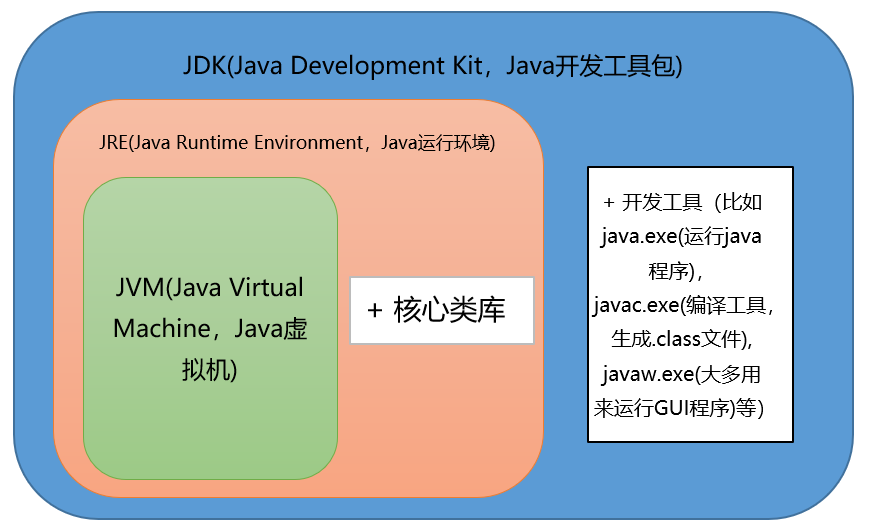

# JAVA语法基础

## Java概述

###  什么是Java
  Java是一门面向对象编程语言，不仅吸收了C++语言的各种优点，还摒弃了C++里难以理解的多继承、指针等概念，因此Java语言具有功能强大和简单易用两个特征。Java语言作为静态面向对象编程语言的代表，极好地实现了面向对象理论，允许程序员以优雅的思维方式进行复杂的编程 。

### JVM、JRE和JDK的关系
  - JVM
    - Java Virtual Machine是Java虚拟机，Java程序需要运行在虚拟机上，不同的平台有自己的虚拟机，因此Java语言可以实现跨平台。
  - JRE
    - Java Runtime Environment包括Java虚拟机和Java程序所需的核心类库等。核心类库主要是java.lang包：包含了运行Java程序必不可少的系统类，如基本数据类型、基本数学函数、字符串处理、线程、异常处理类等，系统缺省加载这个包
      如果想要运行一个开发好的Java程序，计算机中只需要安装JRE即可。
  - JDK
    - Java Development Kit是提供给Java开发人员使用的，其中包含了Java的开发工具，也包括了JRE。所以安装了JDK，就无需再单独安装JRE了。其中的开发工具：编译工具(javac.exe)，打包工具(jar.exe)等
  - JVM&JRE&JDK关系图：
    )

### Oracle JDK 和 OpenJDK 的对比
  - Oracle JDK版本将每三年发布一次，而OpenJDK版本每三个月发布一次；
  - OpenJDK 是一个参考模型并且是完全开源的，而Oracle JDK是OpenJDK的一个实现，并不是完全开源的；
  - Oracle JDK 比 OpenJDK 更稳定。OpenJDK和Oracle JDK的代码几乎相同，但Oracle JDK有更多的类和一些错误修复。因此，如果您想开发企业/商业软件，我建议您选择Oracle JDK，因为它经过了彻底的测试和稳定。某些情况下，有些人提到在使用OpenJDK 可能会遇到了许多应用程序崩溃的问题，但是，只需切换到Oracle JDK就可以解决问题；
  - 在响应性和JVM性能方面，Oracle JDK与OpenJDK相比提供了更好的性能；
  - Oracle JDK不会为即将发布的版本提供长期支持，用户每次都必须通过更新到最新版本获得支持来获取最新版本；
  - Oracle JDK根据二进制代码许可协议获得许可，而OpenJDK根据GPL v2许可获得许可。

