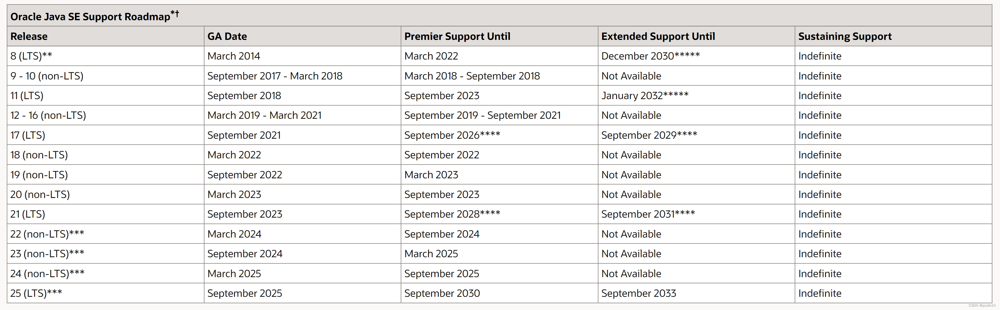
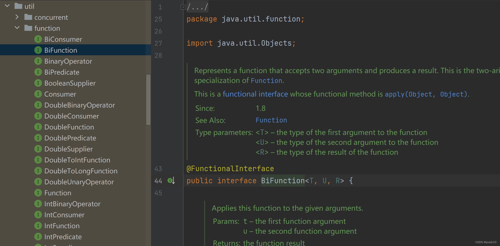

# JAVA各版本特性总结

## 版本roadmap图

- 官方地址：
    https://www.oracle.com/java/technologies/java-se-support-roadmap.html

- 从上图可以很清晰得可以看出，JDK7,JDK8,JDK11,JDK17,JDK21是长期维护的版本。从目前来看，JDK8到2023年已经有将近10年的历史了，大多数依据JDK8的相关技术内容已经很成熟了，但是大家也看到，JDK在不断地迭代，JDK有很多的新特性，而且能够对开发及系统性能有很大帮助。所以现在很多公司在建新系统的时候，在考虑新的JDK。再加上重要的一点是新的spring boot3及对应的spring cloud 2022.X及以上版本，最低支持的JDK也需要JDK17了。所以要想跟上技术迭代，还需我们自己对于JDK进行了解，然后根据自己的实际选择相应的版本。

## Java8特性
- Lambda 表达式
    其他语言都已陆续推出Lambda 表达式，java也不落后。
    Lambda 表达式简单来讲是一个匿名函数，Java 8 允许将函数作为参数传递到方法之中。
    它是 Java 8 发布的最为重要的新特性之一，跟上了目前语言发展的趋势，是继泛型（Generics）和注解（Annotation）以来最大的突破。
    采用 Lambda 表达式可以大幅简化代码的编写，开发人员在熟练之后，可以很简单的书写相关的功能，并且提升了相应的效率，这就是函数式编程。

- Stream流
Stream流计算是一个跟当前很贴合的，随着计算能力提升及数据量的增加，这个是有必要的。有鉴于此，Java 新增了 java.util.stream 包，它和以前的流十分类似。以前我们最常接触到的是资源流，例如 java.io.FileInputStream，它通过流的方式把文件从一个地方输入到另一个地方，与文件内容无关，只是一种内容搬运工作，不涉及任何 CRUD 操作。
- java8的两种流类型：
stream 串行流
parallelStream 并行流
Stream 的源数据来于 Collection、Arrays 等类型，因为它的方法参数都是函数式接口类型，所以通常和 Lambda 表达式一起使用。
Stream 不存储数据，也不改变源数据，但它提供了对集合数据进行检索和逻辑处理的功能，包括筛选、排序、统计、计数等。可以形象地将其比作 SQL 语句。

- Optional
  主要用来处理传入的数据的空指针NullPointerException问题。
  假设有一个 Person 类，里面有个属性 Hobby，需求要获取Hobby的 scope。
  ```
  class Person {
    private Hobby hobby;
  }
    class Hobby {
    private String scope;
  }
  ```
我们以前这样写：
  ```
    Person  person = buildPerson();
    if(person != null) {
    Hobby hobby = person.getHobby();
    if (hobby != null) {
       String scope = hobby.getScope();
       System.out.println(scope);
    }
  ```
用了Optional:
  ```
    Optional.ofNullable(person)
        .map(p -> p.getHobby())
        .map(h -> h.getScope())
        .ifPresent(scope ->System.out.println(scope));
  ```
- Interface
  Interface 的初始设计目的是面向抽象，提高可扩展性。但这也带来了一个不足之处，即当 Interface 进行修改时，实现它的类也必须相应地进行修改。

    为了解决 Interface 修改与现有实现不兼容的问题，现在可以使用 default 或 static 关键词修饰 interface 的方法，这样就可以给方法提供一个默认实现，而实现类无需重写此方法。

    一个 Interface 中可以有多个方法被这两种关键词所修饰。二者的区别在于，default 方法是普通实例方法，可以使用 this 关键词调用，可以被子类继承和重写；而 static 方法与一般类的静态方法类似，无法被子类继承，只能通过 Interface 调用。

    如果有一个类既实现了 2个接口，都有相同名称的方法，并且两个接口没有继承关系的话，这时就必须重写同名方法()。不然的话，编译的时候就会报错。
- functional interface 函数式接口
  - 定义：有且只有一个抽象方法，但可以有多个非抽象方法的接口。
  - 在 java 8 中专门有一个包放函数式接口java.util.function，该包下的所有接口都有 @FunctionalInterface 注解，提供函数式编程。
  - 
  - 在其他包中也有函数式接口，其中一些没有@FunctionalInterface 注解，但是只要符合函数式接口的定义就是函数式接口，与是否有@FunctionalInterface注解无关，注解只是在编译时起到强制规范定义的作用。其在 Lambda 表达式中有广泛的应用。
  ```
    @FunctionalInterface
    public interface TestFunction<T, U,E,F,G,GH,HV, R> {
        R apply(T t, U u, E e, F f, G g, GH gh, HV hv);
    }
  ```
- Date-Time API
  这是对java.util.Date强有力的补充，解决了 Date 类的大部分痛点：
  - 非线程安全
  - 时区处理麻烦
  - 各种格式化、和时间计算繁琐
  - 设计有缺陷，Date 类同时包含日期和时间；还有一个 java.sql.Date，容易混淆。

## java9新特性
- 1.模块化系统
    - java9的时候最大的一个新特性是模块化系统，模块系统的核心原理是将应用程序划分为一组模块,并通过 module-info.java 文件来定义模块的信息和依赖关系
    - Java 应用可以通过新增的Jlink工具 (Jlink 是随 Java 9 一起发布的新命令行工具。JDK 9 引入的新特性允许开发人员为基于模块化的 Java 应用程序创建自定义、轻量级的 JRE（Java Runtime Environment）。开发人员可以根据所依赖的 JDK 模块创建自定义的运行时镜像，这将大大减少 Java 运行时环境的大小。
    - 我们可以通过 exports 关键词控制模块及使用范围。
    ```
    module limit.module {
        //exports 公开指定包的所有公共成员
        exports com.my.package.name;
    }
    module limit.module {
        //exports…to 限制访问的成员范围
        export com.limit.package.name to com.target.limit.package;
    }
    ```
- 2.G1 成为默认垃圾回收器
  - 在 Java 8 中，默认使用的垃圾回收器为 Parallel Scavenge（新生代）+Parallel Old（老年代）。但到了 Java 9，CMS 垃圾回收器被弃用，取而代之的是 G1（Garbage-First Garbage Collector），成为新的默认垃圾回收器。
  - 实际上，G1 垃圾回收器在 Java 7 中就已经被引入，而经过两个版本的表现表现优异后，它于 Java 9 成为了默认的垃圾回收器。

- 3.接口私有方法
  - Java 9 允许在接口中使用私有方法。
  ```
    public interface PrivateInterface {
         private void privateM(){
        }
    }
  ```
- 4.快速创建不可变集合
  增加了List.of()、Set.of()、Map.of() 和 Map.ofEntries()等工厂方法来创建不可变集合。使用 of() 创建的集合为不可变集合，不能进行添加、删除、替换、 排序等操作，不然会报 java.lang.UnsupportedOperationException 异常。
  
- 5.String 存储结构优化
  Java 8 及之前的版本，String 一直是用 char[] 存储。在 Java 9 之后，String 的实现改用 byte[] 数组存储字符串，节省了空间。

- 6.try-with-resources 增强
  在 Java 9 之前，我们只能在 try-with-resources 块中声明变量：
    ```
  try (FileInputStream inputStream = new FileInputStream("a.txt");) {
    } catch (IOException e) {
    throw new RuntimeException(e);
    }
  ```
  在 Java 9 之后，在 try-with-resources 语句中可以使用 effectively-final 变量。
    ```
  final FileInputStream inputStream = new FileInputStream("a.txt"); 
    try (inputStream) {
    } catch (IOException e) {
    throw new RuntimeException(e);
    }
  ```
  什么是 effectively-final 变量？ 如果对象或基础类型的变量在初始化后值不发生改变,则可以把它们看做 effectively final

- 7.Stream & Optional 增强
  Stream 中增加了新的方法 ofNullable()、dropWhile()、takeWhile() 以及 iterate() 方法的重载方法。

- 8.进程 API
  Java 9 增加了 java.lang.ProcessHandle 接口来实现对原生进程进行管理，尤其适合于管理长时间运行的进程。

- 9.响应式流 （ Reactive Streams ）
  - 在 Java 9 中的 java.util.concurrent.Flow 类中新增了反应式流规范的核心接口 。
  - Flow 中包含了 Flow.Publisher、Flow.Subscriber、Flow.Subscription 和 Flow.Processor 等 4 个核心接口。Java 9 还提供了SubmissionPublisher 作为Flow.Publisher 的一个实现。

- 10.变量句柄
    - 变量句柄是一个变量或一组变量的引用，包括静态域，非静态域，数组元素和堆外数据结构中的组成部分等。
    - 变量句柄的含义类似于已有的方法句柄 MethodHandle ，由 Java 类 java.lang.invoke.VarHandle 来表示，可以使用类 java.lang.invoke.MethodHandles.Lookup 中的静态工厂方法来创建 VarHandle 对象。
    - VarHandle 的出现替代了 java.util.concurrent.atomic 和 sun.misc.Unsafe 的部分操作。并且提供了一系列标准的内存屏障操作，用于更加细粒度的控制内存排序。在安全性、可用性、性能上都要优于现有的 API。

- 11.平台日志 API 改进
  Java 9 允许为 JDK 和应用配置同样的日志实现。新增了 System.LoggerFinder 用来管理 JDK 使 用的日志记录器实现。JVM 在运行时只有一个系统范围的 LoggerFinder 实例。我们可以通过添加自己的 System.LoggerFinder 实现来让 JDK 和应用使用 SLF4J 等其他日志记录框架。

- 12.CompletableFuture类增强
  新增了几个新的方法（completeAsync ，orTimeout 等）

- 13.I/O 流的新特性
  增加了新的方法来读取和复制 InputStream 中包含的数据

- 14.改进方法句柄（Method Handle）
  方法句柄从 Java7 开始引入，Java9 在类java.lang.invoke.MethodHandles 中新增了更多的静态方法来创建不同类型的方法句柄

## java10新特性
- 1.局部变量类型推断(var)
  Java 10 提供了 var 关键字声明局部变量。
    ```
    var i = 0;
    var url = new URL("https://mp.weixin.qq.com/");
    var list = new ArrayList<>();
    var map = new HashMap<String, String>();
    for (var n : list){
        System.out.print(n+ " ");
    }
    ```
    var不能声明为 null,不能声明为 Lambda表达式。

- 2.垃圾回收器接口
  在早期的 JDK 结构中，组成垃圾收集器 (GC) 实现的组件分散在代码库的各个部分。 Java 10 通过引入一套纯净的垃圾收集器接口来将不同垃圾收集器的源代码分隔开。

- 3.G1 并行 Full GC
  - 从 Java9 开始 G1 就了默认的垃圾回收器，G1 是以一种低延时的垃圾回收器来设计的，旨在避免进行 Full GC,但是 Java9 的 G1 的 FullGC 依然是使用单线程去完成标记清除算法,这可能会导致垃圾回收期在无法回收内存的时候触发 Full GC。
  - 为了最大限度地减少 Full GC 造成的应用停顿的影响，从 Java10 开始，G1 的 FullGC 改为并行的标记清除算法，同时会使用与年轻代回收和混合回收相同的并行工作线程数量，从而减少了 Full GC 的发生，以带来更好的性能提升、更大的吞吐量。

- 4.集合增强
  List，Set，Map 提供了静态方法copyOf()返回入参集合的一个不可变拷贝。
    ```
    static <E> List<E> copyOf(Collection<? extends E> coll) {
        return ImmutableCollections.listCopy(coll);
    }
    ```
  使用 copyOf() 创建的集合为不可变集合，不能进行添加、删除、替换、 排序等操作，不然会报 java.lang.UnsupportedOperationException 异常。
  并且，java.util.stream.Collectors 中新增了静态方法，用于将流中的元素收集为不可变的集合。
    ```
    var list = new ArrayList<>();
    list.stream().collect(Collectors.toUnmodifiableList());
    list.stream().collect(Collectors.toUnmodifiableSet());
    ```

- 5.Optional 增强
  Optional 新增了orElseThrow()方法来在没有值时抛出指定的异常。
    ```
      Optional.ofNullable(cache.getIfPresent(key))
        .orElseThrow(() -> new PersonalException( "personal Exception for key: " + key));
    ```
  
- 6.应用程序类数据共享(扩展 CDS 功能)
  - 在 Java 5 中就已经引入了类数据共享机制 (Class Data Sharing，简称 CDS)，允许将一组类预处理为共享归档文件，以便在运行时能够进行内存映射以减少 Java 程序的启动时间，当多个 Java 虚拟机（JVM）共享相同的归档文件时，还可以减少动态内存的占用量，同时减少多个虚拟机在同一个物理或虚拟的机器上运行时的资源占用。CDS 在当时还是 Oracle JDK 的商业特性。

  - Java 10 在现有的 CDS 功能基础上再次拓展，以允许应用类放置在共享存档中。CDS 特性在原来的 bootstrap 类基础之上，扩展加入了应用类的 CDS 为 (Application Class-Data Sharing，AppCDS) 支持，大大加大了 CDS 的适用范围。其原理为：在启动时记录加载类的过程，写入到文本文件中，再次启动时直接读取此启动文本并加载。设想如果应用环境没有大的变化，启动速度就会得到提升。

- 7.线程-局部管控
  Java 10 中线程管控引入 JVM 安全点的概念，将允许在不运行全局 JVM 安全点的情况下实现线程回调，由线程本身或者 JVM 线程来执行，同时保持线程处于阻塞状态，这种方式使得停止单个线程变成可能，而不是只能启用或停止所有线程

- 8.备用存储装置上的堆分配
  Java 10 中将使得 JVM 能够使用适用于不同类型的存储机制的堆，在可选内存设备上进行堆内存分配

## java11新特性

- 1.HTTP Client 标准化
    Java 11 标准化了 Java 9 中引入的 Http Client API，并在 Java 10 中进行了更新。在前两个版本中对 Http Client 进行孵化的同时，该 API 几乎被完全重写，并且现在已经完全支持异步非阻塞。

    此外，Java 11 中，Http Client 的包名已由 jdk.incubator.http 更改为 java.net.http。该 API 通过 CompleteableFuture 提供了非阻塞请求和响应语义。使用起来也非常简单，例如：
    ```
    var request = HttpRequest.newBuilder()
    .uri(URI.create("https://javastack.cn"))
    .GET()
    .build();var client = HttpClient.newHttpClient();
    // 同步
    HttpResponse<String> response = client.send(request, HttpResponse.BodyHandlers.ofString());System.out.println(response.body());
    //异步
    client.sendAsync(request, HttpResponse.BodyHandlers.ofString())
    .thenApply(HttpResponse::body)
    .thenAccept(System.out::println);
    ```
- 2.启动单文件源代码程序
  这意味着我们可以运行单一文件的 Java 源代码。此功能允许使用 Java 解释器直接执行 Java 源代码。源代码在内存中编译，然后由解释器执行，不需要在磁盘上生成 .class 文件了。唯一的约束在于所有相关的类必须定义在同一个 Java 文件中。

    对于 Java 初学者并希望尝试简单程序的人特别有用，并且能和 jshell 一起使用。一定能程度上增强了使用 Java 来写脚本程序的能力。

- 3.新的垃圾回收器 Epsilon
  一个完全消极的 GC 实现，分配有限的内存资源，最大限度的降低内存占用和内存吞吐延迟时间

- 4.低开销的 Heap Profiling
  Java 11 中提供一种低开销的 Java 堆分配采样方法，能够得到堆分配的 Java 对象信息，并且能够通过 JVMTI 访问堆信息

- 5.飞行记录器(Java Flight Recorder)
  飞行记录器之前是商业版 JDK 的一项分析工具，但在 Java 11 中，其代码被包含到公开代码库中，这样所有人都能使用该功能了。

- 6.String 增强
  Java 11 增加了一系列的字符串处理方法：

    ```
    //判断字符串是否为空
    System.out.println(" ".isBlank());
    // 去除字符串首尾空格
    System.out.println("结果:"+" 去除字符串首尾空格 ".strip()+"结束");
    // 去除字符串首部空格
    System.out.println("结果:"+"去除字符串首部空格 ".stripLeading()+"结束");
    // 去除字符串尾部空格
    System.out.println("结果:"+" 去除字符串尾部空格 ".stripTrailing()+"结束");
    // 重复字符串多少次
    System.out.println(" 重复字符串多少次 ".repeat(2));
    // 返回由行终止符分隔次数。
    System.out.println("A\nB\nC".lines().count());
    // 返回由行终止符分隔的字符串集合。
    System.out.println("A\nB\nC".lines().collect(Collectors.toList()));
    ```
- 7.Optional 增强
  新增了empty()方法来判断指定的 Optional 对象是否为空。
    ```
    var obj= Optional.empty();
    //判断指定的 Optional 对象是否为空
    System.out.println(obj.isEmpty());
  ```

- 8.Lambda 参数的局部变量语法
  从 Java 10 开始，便引入了局部变量类型推断这一关键特性。类型推断允许使用关键字 var 作为局部变量的类型而不是实际类型，编译器根据分配给变量的值推断出类型。

  Java 10 中对 var 关键字存在几个限制
  - 只能用于局部变量上
  - 声明时必须初始化
  - 不能用作方法参数
  - 不能在 Lambda 表达式中使用
Java11 开始允许开发者在 Lambda 表达式中使用 var 进行参数声明。

    // 下面两者是等价的
    ```
    Consumer<String> consumer = (var c) -> System.out.println(c);
    Consumer<String> consumer = (String c) -> System.out.println(c);
    ```

## java12新特性

- 1.数字格式化工具类
  NumberFormat 新增了对复杂的数字进行格式化的支持
    ```
        NumberFormat fmtShort = NumberFormat.getCompactNumberInstance(Locale.CHINESE, NumberFormat.Style.SHORT);
        String resultShort = fmtShort.format(10000000);
        System.out.println(resultShort);
 
        NumberFormat fmt2Short = NumberFormat.getCompactNumberInstance(Locale.US, NumberFormat.Style.SHORT);
        String result2Short = fmt2Short.format(10000000);
        System.out.println(result2Short);
 
        NumberFormat fmtLong = NumberFormat.getCompactNumberInstance(Locale.CHINESE, NumberFormat.Style.LONG);
        String resultLong = fmtLong.format(10000000);
        System.out.println(resultLong);
 
        NumberFormat fmt2Long = NumberFormat.getCompactNumberInstance(Locale.US, NumberFormat.Style.LONG);
        String result2Long = fmt2Long.format(10000000);
        System.out.println(result2Long);
  ```

- 2.Shenandoah GC
  Redhat 主导开发的 Pauseless GC 实现，主要目标是 99.9% 的暂停小于 10ms，暂停与堆大小无关等

  和 Java11 开源的 ZGC 相比（需要升级到 JDK11 才能使用），Shenandoah GC 有稳定的 JDK8u 版本，在 Java8 占据主要市场份额的今天有更大的可落地性。

- 3.String 增强
  Java 11 增加了两个的字符串处理方法
  - indent() 方法可以实现字符串缩进。
    ```
      public String indent(int n) {
      if (isEmpty()) {
          return "";
      }
      Stream<String> stream = lines();
      if (n > 0) {
          final String spaces = " ".repeat(n);
          stream = stream.map(s -> spaces + s);
      } else if (n == Integer.MIN_VALUE) {
          stream = stream.map(s -> s.stripLeading());
      } else if (n < 0) {
          stream = stream.map(s -> s.substring(Math.min(-n, s.indexOfNonWhitespace())));
      }
      return stream.collect(Collectors.joining("\n", "", "\n"));
    }
      ```  
  - transform() 方法可以用来转变指定字符串。
    ```
    public <R> R transform(Function<? super String, ? extends R> f) {
        return f.apply(this);
    }
    
    //indent() 方法可以实现字符串缩进。
    String text = "缩进";
    // 缩进 4 格
    text = text.indent(4);
    System.out.println(text);
    //transform() 增加的直接使用的方法函数式编程方法。
    String result = "源数据".transform(input -> input + " 增加");
    System.out.println(result);
    ```
- 4.Files 增强（文件比较）
  Java 12 添加了以下方法来比较两个文件：
    ```
    public static long mismatch(Path path, Path path2) throws IOException
  ```
  mismatch() 方法用于比较两个文件，并返回第一个不匹配字符的位置，如果文件相同则返回 -1L。

- 5.G1 收集器优化
  Java12 为默认的垃圾收集器 G1 带来了两项更新:
    - 可中止的混合收集集合 ：JEP344 的实现，为了达到用户提供的停顿时间目标，JEP 344 通过把要被回收的区域集（混合收集集合）拆分为强制和可选部分，使 G1 垃圾回收器能中止垃圾回收过程。 G1 可以中止可选部分的回收以达到停顿时间目标
    - 及时返回未使用的已分配内存 ：JEP346 的实现，增强 G1 GC，以便在空闲时自动将 Java 堆内存返回给操作系统

## Java13新特性

- 1.增强 ZGC(释放未使用内存)
  在 Java 11 中是实验性的引入的 ZGC 在实际的使用中存在未能主动将未使用的内存释放给操作系统的问题。

  ZGC 堆由一组称为 ZPages 的堆区域组成。在 GC 周期中清空 ZPages 区域时，它们将被释放并返回到页面缓存 ZPageCache 中，此缓存中的 ZPages 按最近最少使用（LRU）的顺序，并按照大小进行组织。

  在 Java 13 中，ZGC 将向操作系统返回被标识为长时间未使用的页面，这样它们将可以被其他进程重用。

- 2.SocketAPI 重构
  Java Socket API 终于迎来了重大更新！

  Java 13 将 Socket API 的底层进行了重写， NioSocketImpl 是对 PlainSocketImpl 的直接替代，它使用 java.util.concurrent 包下的锁而不是同步方法。如果要使用旧实现，请使用 -Djdk.net.usePlainSocketImpl=true。

  并且，在 Java 13 中是默认使用新的 Socket 实现。

   ```
  public final class NioSocketImpl extends SocketImpl implements PlatformSocketImpl {}
    ```

- 3.FileSystems
  FileSystems 类中添加了以下三种新方法，以便更容易地使用将文件内容视为文件系统的文件系统提供程序：
  - newFileSystem(Path)
  - newFileSystem(Path, Map<String, ?>)
  - newFileSystem(Path, Map<String, ?>, ClassLoader)

- 4.动态 CDS 存档
  Java 13 中对 Java 10 中引入的应用程序类数据共享(AppCDS)进行了进一步的简化、改进和扩展，即：允许在 Java 应用程序执行结束时动态进行类归档，具体能够被归档的类包括所有已被加载，但不属于默认基层 CDS 的应用程序类和引用类库中的类。

    这提高了应用程序类数据共享（AppCDSopen in new window）的可用性。无需用户进行试运行来为每个应用程序创建类列表。

    $ java -XX:ArchiveClassesAtExit=my_app_cds.jsa -cp my_app.jar

    $ java -XX:SharedArchiveFile=my_app_cds.jsa -cp my_app.jar

## Java14新特性

- 1.空指针异常精准提示
  通过 JVM 参数中添加-XX:+ShowCodeDetailsInExceptionMessages，可以在空指针异常中获取更为详细的调用信息，更快的定位和解决问题。
    ```
    a.b.c.i = 99; // 假设这段代码会发生空指针
    //Java 14 之前：
    //Exception in thread "main" java.lang.NullPointerException
    //at NullPointerExample.main(NullPointerExample.java:5)

    Java 14 之后：
    // 增加参数后提示的异常中很明确的告知了哪里为空导致Exception in thread "main" java.lang.NullPointerException:
    Cannot read field 'c' because 'a.b' is null.
    at Prog.main(Prog.java:5)
  ```

- 2.switch 的增强(转正)
  Java12 引入的 switch（预览特性）在 Java14 变为正式版本，不需要增加参数来启用，直接在 JDK14 中就能使用。

  Java12 为 switch 表达式引入了类似 lambda 语法条件匹配成功后的执行块，不需要多写 break ，Java13 提供了 yield 来在 block 中返回值。

- 3.ZGC支持
  从 Java11 引入的 ZGC 作为继 G1 过后的下一代 GC 算法，从支持 Linux 平台到 Java14 开始支持 MacOS 和 Window

- 4.移除 CMS
  移除了 CMS(Concurrent Mark Sweep) 垃圾收集器

- 5.新增了 jpackage 工具
  jpackage 工具，标配将应用打成 jar 包外，还支持不同平台的特性包，比如 linux 下的deb和rpm，window 平台下的msi和exe

## Java15新特性

- 1.隐藏类(Hidden Classes)
  隐藏类是为框架（frameworks）所设计的，隐藏类不能直接被其他类的字节码使用，只能在运行时生成类并通过反射间接使用它们

- 2.TreeMap增强
  TreeMap 新引入了下面这些方法：
  - putIfAbsent()
  - computeIfAbsent()
  - computeIfPresent()
  - compute()
  - merge()

- 3.ZGC
  Java11 的时候 ，ZGC 还在试验阶段。

    当时，ZGC 的出现让众多 Java 开发者看到了垃圾回收器的另外一种可能，因此备受关注。

    经过多个版本的迭代，不断的完善和修复问题，ZGC 在 Java 15 已经可以正式使用了！

    不过，默认的垃圾回收器依然是 G1。你可以通过下面的参数启动 ZGC：

    $ java -XX:+UseZGC className

- 4.文本块
  在 Java 15 ，文本块是正式的功能特性了

- 5.禁用和废弃偏向锁（Biased Locking）
  偏向锁的引入增加了 JVM 的复杂性大于其带来的性能提升。不过，你仍然可以使用 -XX:+UseBiasedLocking 启用偏向锁定，但它会提示 这是一个已弃用的 API。


## java16新特性

- 1.启用 C++ 14 语言特性
    Java 16 允许在 JDK 的 C++ 源代码中使用 C++14 语言特性，并提供在 HotSpot 代码中可以使用哪些特性的具体指导。

    在 Java 15 中，JDK 中 C++ 代码使用的语言特性仅限于 C++98/03 语言标准。它要求更新各种平台编译器的最低可接受版本。

- 2.ZGC 并发线程堆栈处理
  Java16 将 ZGC 线程栈处理从安全点转移到一个并发阶段，甚至在大堆上也允许在毫秒内暂停 GC 安全点。消除 ZGC 垃圾收集器中最后一个延迟源可以极大地提高应用程序的性能和效率。

- 3.弹性元空间
  自从引入了 Metaspace 以来，根据反馈，Metaspace 经常占用过多的堆外内存，从而导致内存浪费。弹性元空间这个特性可将未使用的 HotSpot 类元数据（即元空间，metaspace）内存更快速地返回到操作系统，从而减少元空间的占用空间。

- 4.打包工具
  在 Java 14 中，JEP 343 引入了打包工具，命令是 jpackage。在 Java 15 中，继续孵化，现在在 Java 16 中，终于成为了正式功能。

- 5.instanceof 模式匹配(转正)

  |JDK 版本|更新类型|JEP|更新内容|
  |---|---|---|---|
  |Java SE 14|preview|JEP 305open in new window|首次引入 instanceof 模式匹配。|
  |Java SE 15|Second Preview|JEP 375open in new window|添加了更多的模式匹配语法。|
  |Java SE 16|Permanent Release|JEP 394open in new window|模式变量不在隐式为 final。|

    从 Java 16 开始，你可以对 instanceof 中的变量值进行修改。
    
    ```
        String o = "";
        // 原来
        if (o instanceof String) {
        String s = (String) o;
        }
        Object c = null;
        c = "";
        // 新的
        if (c instanceof String b) {
        b = "b";
        System.out.println("c=" + c);
        System.out.println("b=" + b);
        }    
    ```

- 6.记录类型
  记录类型变更历史：

    |JDK 版本|更新类型|JEP|更新内容|
    |---|---|---|---|
    |Java SE 14|Preview|JEP 359open in new window|引入 record 关键字，record 提供一种紧凑的语法来定义类中的不可变数据。|
    |Java SE 15|Second Preview|JEP 384open in new window|支持在局部方法和接口中使用 record。|
    |Java SE 16|Permanent Release|JEP 395open in new window|非静态内部类可以定义非常量的静态成员。|

  从 Java SE 16 开始，非静态内部类可以定义非常量的静态成员。
    ```
    public class Outer {
    class Inner {
        static int age;
        }
    }
  ```
  在 JDK 16 之前，如果写上面这种代码，IDE 会提示你静态字段 age 不能在非静态的内部类中定义，除非它用一个常量表达式初始化。

## java17新特性

Java 17 将是继 Java 8 以来最重要的长期支持（LTS）版本，是 Java 社区八年努力的成果。Spring 6.x 和 Spring Boot 3.x ,Spring Cloud 2022.X最低支持的就是 Java 17。

- 1.增强的伪随机数生成器

    JDK 17 之前，我们可以借助 Random、ThreadLocalRandom和SplittableRandom来生成随机数。不过，这 3 个类都各有缺陷，且缺少常见的伪随机算法支持。

    Java 17 为伪随机数生成器 （pseudorandom number generator，RPNG，又称为确定性随机位生成器）增加了新的接口类型和实现，使得开发者更容易在应用程序中互换使用各种 PRNG 算法。

    RPNGopen in new window 用来生成接近于绝对随机数序列的数字序列。一般来说，PRNG 会依赖于一个初始值，也称为种子，来生成对应的伪随机数序列。只要种子确定了，PRNG 所生成的随机数就是完全确定的，因此其生成的随机数序列并不是真正随机的。

    使用示例：
    
    ```
        RandomGeneratorFactory<RandomGenerator> l128X256MixRandom = RandomGeneratorFactory.of("L128X256MixRandom");
        // 使用时间戳作为随机数种子
        RandomGenerator randomGenerator = l128X256MixRandom.create(System.currentTimeMillis());
        // 生成随机数
        randomGenerator.nextInt(10));
    ```

- 2.弃用 Applet API 以进行删除

   Applet API 用于编写在 Web 浏览器端运行的 Java 小程序，很多年前就已经被淘汰了，已经没有理由使用了。

   Applet API 在 Java 9 时被标记弃用（JEP 289open in new window），但不是为了删除。

- 3.删除远程方法调用激活机制

  删除远程方法调用 (RMI) 激活机制，同时保留 RMI 的其余部分。RMI 激活机制已过时且不再使用。

- 4.密封类（转正）

  密封类由 JEP 360open in new window 提出预览，集成到了 Java 15 中。在 JDK 16 中， 密封类得到了改进（更加严格的引用检查和密封类的继承关系），由 JEP 397open in new window 提出了再次预览。

- 5.删除实验性的 AOT 和 JIT 编译器

    在 Java 9 的 JEP 295open in new window ,引入了实验性的提前 (AOT) 编译器，在启动虚拟机之前将 Java 类编译为本机代码。

    Java 17，删除实验性的提前 (AOT) 和即时 (JIT) 编译器，因为该编译器自推出以来很少使用，维护它所需的工作量很大。保留实验性的 Java 级 JVM 编译器接口 (JVMCI)，以便开发人员可以继续使用外部构建的编译器版本进行 JIT 编译。

## java18新特性

- 1.默认字符集为 UTF-8

    JDK 终于将 UTF-8 设置为默认字符集。

    在 Java 17 及更早版本中，默认字符集是在 Java 虚拟机运行时才确定的，取决于不同的操作系统、区域设置等因素，因此存在潜在的风险。就比如说你在 Mac 上运行正常的一段打印文字到控制台的 Java 程序到了 Windows 上就会出现乱码，如果你不手动更改字符集的话。

- 2.简易的 Web 服务器

  Java 18 之后，你可以使用 jwebserver 命令启动一个简易的静态 Web 服务器。
    ```
      $ jwebserver
      Binding to loopback by default. For all interfaces use "-b 0.0.0.0" or "-b ::".
      Serving /cwd and subdirectories on 127.0.0.1 port 8000
      URL: http://127.0.0.1:8000/
  ```

    这个服务器不支持 CGI 和 Servlet，只限于静态文件。

- 3.优化 Java API 文档中的代码片段

  在 Java 18 之前，如果我们想要在 Javadoc 中引入代码片段可以使用 <pre>{@code ...}</pre> 。
    ```
  <pre>{@code
      lines of source code
    }</pre>
    <pre>{@code ...}</pre> 这种方式生成的效果比较一般。
  ```

在 Java 18 之后，可以通过 @snippet 标签来做这件事情。
    
```
    /**
    * The following code shows how to use {@code Optional.isPresent}:
      * {@snippet :
      * if (v.isPresent()) {
      *     System.out.println("v: " + v.get());
      * }
      * }
        */   
```
    
@snippet 这种方式生成的效果更好且使用起来更方便一些。


- 4.使用方法句柄重新实现反射核心

  Java 18 改进了 java.lang.reflect.Method、Constructor 的实现逻辑，使之性能更好，速度更快。这项改动不会改动相关 API ，这意味着开发中不需要改动反射相关代码，就可以体验到性能更好反射。

- 5.互联网地址解析 SPI

  Java 18 定义了一个全新的 SPI（service-provider interface），用于主要名称和地址的解析，以便 java.net.InetAddress 可以使用平台之外的第三方解析器。

## Java 19 新特性

- 1.虚拟线程（预览）

    - 虚拟线程（Virtual Thread-）是 JDK 而不是 OS 实现的轻量级线程(Lightweight Process，LWP），许多虚拟线程共享同一个操作系统线程，虚拟线程的数量可以远大于操作系统线程的数量。

    - 虚拟线程在其他多线程语言中已经被证实是十分有用的，比如 Go 中的 Goroutine、Erlang 中的进程。

    - 虚拟线程避免了上下文切换的额外耗费，兼顾了多线程的优点，简化了高并发程序的复杂，可以有效减少编写、维护和观察高吞吐量并发应用程序的工作量。

- 2.结构化并发(孵化)

  - JDK 19 引入了结构化并发，一种多线程编程方法，目的是为了通过结构化并发 API 来简化多线程编程，并不是为了取代java.util.concurrent，目前处于孵化器阶段。

  - 结构化并发非常适合虚拟线程，虚拟线程是 JDK 实现的轻量级线程。许多虚拟线程共享同一个操作系统线程，从而允许非常多的虚拟线程。


## Java 20 新特性

- 作用域值（第一次孵化）

    ```
    final static ScopedValue<...> V = new ScopedValue<>();

    // In some method
    ScopedValue.where(V, <value>)
    .run(() -> { ... V.get() ... call methods ... });

    // In a method called directly or indirectly from the lambda expression
    ... V.get() ...
  ```
  
作用域值允许在大型程序中的组件之间安全有效地共享数据，而无需求助于方法参数。


## java21新特性

- 1.字符串模板（String Template）

    - 字符串模板是一种新的表达式，用于简化字符串的拼接和插值操作。
    - 通过使用STR模板处理器，可以在字符串中嵌入表达式，并将其求值为字符串。
    - 示例代码：
    ```
    String firstName = "Bill";
    String lastName = "Duck";
    String fullName = STR."{$firstName} {$lastName}";
    // 结果：Bill Duck
    
    int x = 10, y = 20;
    String s = STR."{$x} + {$y} = {$x + $y}";
    // 结果："10 + 20 = 30"
  ```
  
- 2.虚拟线程（Virtual Threads）

    - 虚拟线程是一种轻量级的线程模型，可以提供更高效的并发编程体验。
    - 代码案例：
    ```
    import java.util.concurrent.ExecutorService;
    import java.util.concurrent.Executors;
    
    public class VirtualThreadExample {
        public static void main(String[] args) {
            ExecutorService executor = Executors.newVirtualThreadExecutor();
            executor.submit(() -> {
              System.out.println("Running on a virtual thread");
            });
            executor.shutdown();
        }
    }

  ```

- 3.序列化集合（Serialized Collections）

  - 序列化集合是对Java集合API的增强，可以更方便地序列化和反序列化集合对象。
  - 代码案例：
  
    ```
      import java.io.*;
      import java.util.*;
      public class SerializedCollectionExample {
      public static void main(String[] args) throws IOException, ClassNotFoundException {
      List<String> names = new ArrayList<>(Arrays.asList("Alice", "Bob", "Charlie"));
          // Serialize the collection
          ObjectOutputStream out = new ObjectOutputStream(new FileOutputStream("names.ser"));
          out.writeObject(names);
          out.close();
    
          // Deserialize the collection
          ObjectInputStream in = new ObjectInputStream(new FileInputStream("names.ser"));
          List<String> deserializedNames = (List<String>) in.readObject();
          in.close();
    
          System.out.println(deserializedNames);
          // Output: [Alice, Bob, Charlie]
          }
      }
    ```

- 4.模式匹配（Pattern Matching）

  - 模式匹配是一种新的语言特性，用于简化条件语句中的类型检查和类型转换操作。
  - 可以使用instanceof关键字结合模式匹配来检查对象的类型，并在同一语句中进行类型转换。
  - 示例代码：
    ```
    Object obj = "Hello";
    if (obj instanceof String str) {
      System.out.println(str.toUpperCase());
    }
    // 结果："HELLO"
    ```
- 5.增强的Switch语句（Enhanced Switch）

  - 增强的Switch语句允许在每个case分支中使用表达式，并且不需要使用break关键字来终止分支。
  - 可以使用yield关键字从Switch语句中返回一个值。
  - 示例代码：
    ```
        int dayOfWeek = 3;
        String dayName = switch (dayOfWeek) {
        case 1 -> "Monday";
        case 2 -> "Tuesday";
        case 3 -> "Wednesday";
        default -> "Unknown";
        };
        // 结果："Wednesday"
    ```

- 6.增强的异常处理（Enhanced Exception Handling）

  - 增强的异常处理允许在catch块中使用模式匹配来检查异常的类型，并且可以在同一块中处理多个异常。
  - 可以使用|操作符将多个异常类型组合在一起。
  - 示例代码：
    ```
    try {
        // Some code that may throw exceptions
        } catch (IOException | SQLException e) {
        // Handle IOException or SQLException
    }

    ```

- 7.未命名类和实例 main 方法 

  - 未使用该方法前的 main 方法：
    ```
        public class HelloWorld {
            public static void main(String[] args) {
                System.out.println("Hello, World!");
            }
        }
    ```
  -  使用该新特性之后定义一个 main 方法：
    ```
        class HelloWorld {
            void main() {
                System.out.println("Hello, World!");
            }
        }

    ```
        
  - 进一步精简(未命名的类允许我们不定义类名)：
    ```
        void main() {
            System.out.println("Hello, World!");
        }
    ```

- 8.其他特性
  - 改进的垃圾回收器（Improved Garbage Collector）
  - 增强的并发库（Enhanced Concurrency Utilities）
  - 新的API和库（New APIs and Libraries）
